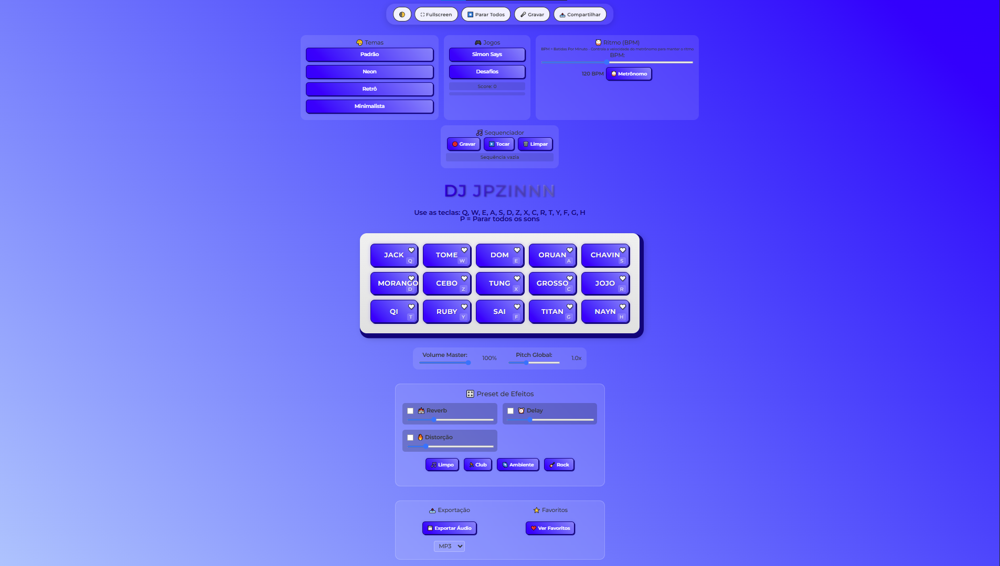
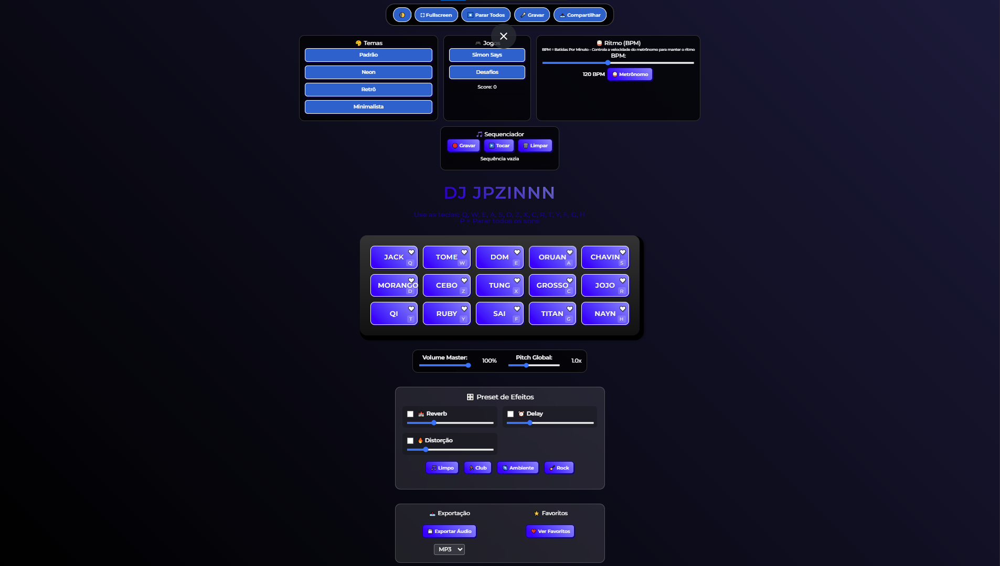
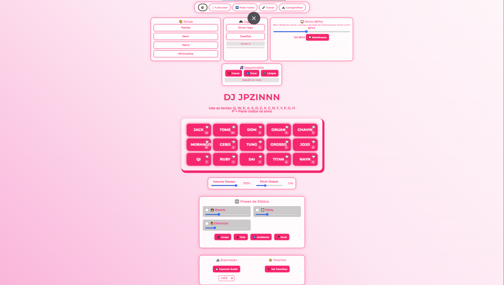
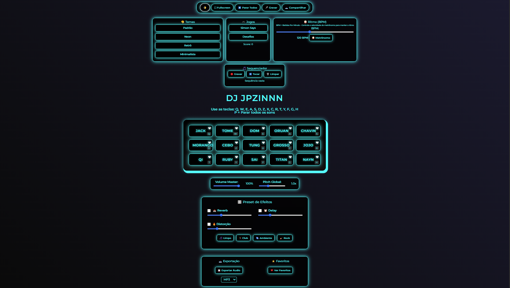
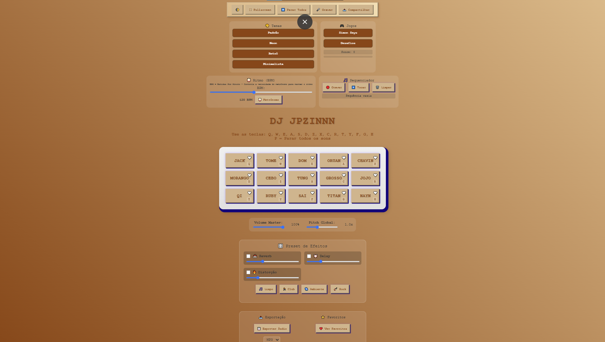
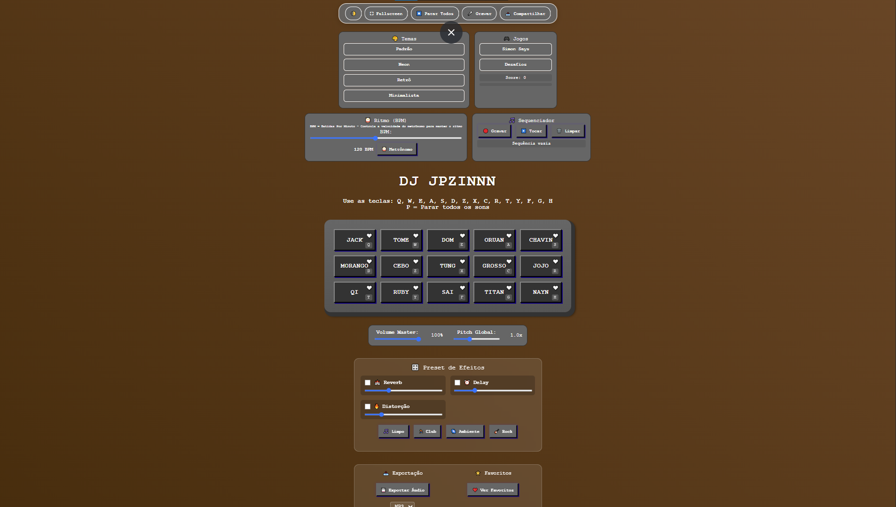
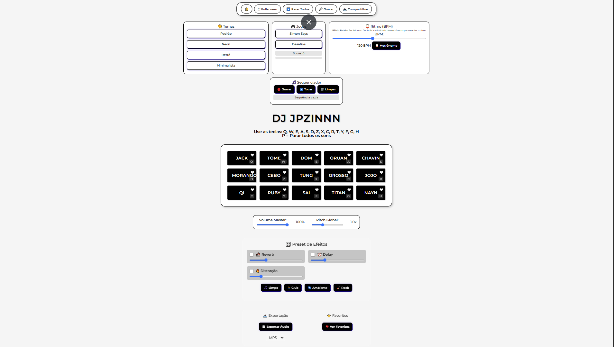
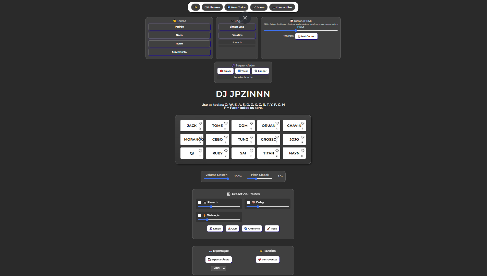

# 🔊 DJ JPZINNN - Meme Sound Pad

Um Sound Pad de memes feito com **HTML**, **CSS** e **JavaScript**, com botões que tocam áudios engraçados da internet!

## 🚀 Funcionalidades Principais

- ✅ **15 sons de memes brasileiros** com teclas de atalho
- ✅ **4 temas visuais** com modos claro/escuro  
- ✅ **Sistema de efeitos** (Reverb, Delay, Distorção)
- ✅ **Presets de efeitos** pré-configurados
- ✅ **Metrônomo integrado** com BPM ajustável
- ✅ **Sequenciador** para gravar e reproduzir sequências
- ✅ **Jogo Simon Says** para treinar memória musical
- ✅ **Sistema de favoritos** para sons e presets
- ✅ **Exportação de áudio** em MP3/WAV
- ✅ **Controles master** de volume e pitch
- ✅ **Design responsivo** para mobile e desktop

## ⌨️ Controles de Teclado

### Teclas de Som
| Linha | Teclas | Sons |
|-------|--------|------|
| Superior | **Q, W, E** | Jack, Tome, Dom |
| Meio | **A, S, D** | Oruan, Chavin, Morango |
| Inferior | **Z, X, C** | Cebolinha, Tung, Grosso |
| Extras | **R, T, Y** | Jojo, Qi, Ruby |
| Finais | **F, G, H** | Sai, Titan, Nayn |

### Teclas Especiais
- **P** - Parar todos os sons
- **F11** - Modo tela cheia

## 🎨 Temas Disponíveis

### Tema Padrão
| Modo Claro | Modo Escuro |
|------------|-------------|
|  |  |

### Tema Neon
| Modo Claro | Modo Escuro |
|------------|-------------|
|  |  |

### Tema Retrô
| Modo Claro | Modo Escuro |
|------------|-------------|
|  |  |

### Tema Minimalista
| Modo Claro | Modo Escuro |
|------------|-------------|
|  |  |

## 🎛️ Sistema de Efeitos

### Presets Disponíveis
- **🎵 Limpo** - Som original sem efeitos
- **🏃 Club** - Reverb médio + Delay leve (atmosfera de festa)
- **🌌 Ambiente** - Reverb intenso + Delay longo (som espacial)
- **🎸 Rock** - Distorção + Reverb leve (som de guitarra)

### Efeitos Individuais
- **🏰 Reverb** - Adiciona eco e profundidade ao som
- **⏰ Delay** - Cria repetições rítmicas do som
- **🔥 Distorção** - Reduz qualidade para efeito "sujo"

## 🎵 Ferramentas Avançadas

### 🎼 Sequenciador
- Grave sequências de sons tocados
- Reproduza automaticamente com timing original
- Limpe e recomece quando quiser

### 🥁 Metrônomo
- BPM ajustável de 60 a 200
- Feedback visual durante reprodução
- Essencial para manter ritmo constante

### ⭐ Sistema de Favoritos
- Marque sons favoritos com ❤️
- Salve presets personalizados de efeitos
- Carregue rapidamente suas configurações

### 💾 Exportação
- Grave sua performance em tempo real
- Exporte em MP3 ou WAV
- Configurações de qualidade ajustáveis

## 🎮 Jogos Integrados

### Simon Says
- Memorize e reproduza sequências de sons
- Dificuldade progressiva
- Treine sua memória musical

### Desafios Aleatórios
- Desafios criativos para praticar
- Diferentes objetivos musicais
- Estimula criatividade

## 🚀 Como Usar

1. **Clone o repositório:**
   ```bash
   git clone https://github.com/jpsantana6699/Pad.git
   ```

2. **Abra o index.html** no seu navegador

3. **Escolha um tema** no painel superior

4. **Teste os sons** clicando ou usando as teclas

5. **Experimente os efeitos** nos presets

6. **Grave sequências** com o sequenciador

7. **Divirta-se** criando suas mixagens!

## 🎤 Como Gravar Novos Sons

1. Clique no botão "🎤 Gravar"
2. Permita o acesso ao microfone
3. Clique em "🔴 Iniciar Gravação"
4. Fale ou reproduza o som desejado
5. Clique em "⏹️ Parar Gravação"
6. Digite um nome para o som
7. Clique em "💾 Salvar"

## 🛠️ Tecnologias Utilizadas

- **HTML5** - Estrutura da aplicação
- **CSS3** - Estilos e temas visuais
- **JavaScript** - Lógica e interatividade
- **Web Audio API** - Manipulação de áudio
- **LocalStorage** - Persistência de dados

## 📱 Compatibilidade

- ✅ Chrome/Chromium (100% das funcionalidades)
- ✅ Firefox (100% das funcionalidades)
- ✅ Safari (95% das funcionalidades)
- ✅ Edge (100% das funcionalidades)
- ✅ Dispositivos móveis (funcionalidades básicas)

## 📁 Estrutura do Projeto

```
js web/
├── README.md
├── index.html
├── main.js
├── css/
│   ├── estilos.css
│   └── reset.css
├── images/
│   ├── bateria.png
│   ├── padrao-claro.png
│   ├── padrao-escuro.png
│   ├── neon-claro.png
│   ├── neon-escuro.png
│   ├── retro-claro.png
│   ├── retro-escuro.png
│   ├── minimal-claro.png
│   └── minimal-escuro.png
└── sounds/
    ├── jack.mp3
    ├── tome.mp3
    └── ... outros sons
```

## 🎵 Sobre os Sons

Todos os sons são memes populares, cuidadosamente selecionados para criar uma experiência divertida e nostálgica da internet.

## 📄 Licença

Este projeto está licenciado sob a licença MIT - veja o arquivo [LICENSE](LICENSE) para detalhes.

---

### **Desenvolvido por João Pedro Santana** - Sound Pad de Memes